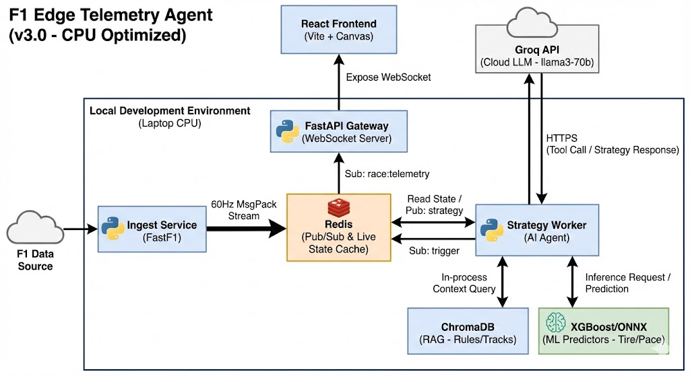

# 🏎️ F1 Telemetry & Strategy Agent (v3.0)

[](https://www.python.org/downloads/release/python-3110/)
[](https://reactjs.org/)
[](https://fastapi.tiangolo.com/)
[](https://redis.io/)

A high-performance, event-driven microservices platform for real-time Formula 1 telemetry visualization and AI-assisted race strategy analysis.

This project ingests historical F1 session data, streams it via binary WebSockets at 60Hz, and utilizes a hybrid AI architecture (Cloud LLM + Local Machine Learning + RAG) to act as a live Race Engineer.

## 🧠 System Architecture



This system relies on a decoupled, asynchronous pipeline optimized for standard CPU environments.

- **Data Bus:** Redis handles 60Hz Pub/Sub streaming and caches live state (gaps, tire age).
- **Ingestion:** Python worker using `fastf1` to fetch, normalize, and pack telemetry into `MsgPack` binaries.
- **Gateway:** FastAPI WebSocket server broadcasting to the frontend.
- **Frontend:** React/Vite SPA utilizing the **HTML5 Canvas API** to bypass DOM reconciliation and render telemetry traces at 60 FPS without memory leaks.
- **Intelligence:**
  - **Deterministic Tools:** Python functions for exact math (intervals, lap times).
  - **Predictive ML:** CPU-optimized `XGBoost` models forecasting tire degradation and pace drop-off.
  - **Knowledge Base (RAG):** `ChromaDB` storing FIA Sporting Regulations and track specifics.
  - **Orchestrator:** `Groq API` (LLaMA-3-70b) synthesizing data via function-calling to output human-readable strategy.

## 🚀 Core Features

- **Zero-Latency Visualization:** Canvas API rendering outpaces standard React DOM updates for heavy telemetry traces.
- **Bandwidth Optimization:** 60Hz streams are compressed using `MsgPack`, reducing payload size by ~40% vs. JSON.
- **Agentic Strategy Worker:** The LLM does not hallucinate math. It retrieves exact gaps from Redis and requests ML predictions before advising on pit stops.
- **Offline Knowledge Base:** Instant lookup of track DRS zones, pit lane times, and penalty rules via ChromaDB.

## 🛠️ Tech Stack

| Domain | Technology |
| :--- | :--- |
| **Frontend** | React 18, Vite, TypeScript, TailwindCSS, HTML5 Canvas API |
| **Backend API** | Python, FastAPI, Uvicorn, WebSockets |
| **Data Engine** | Redis (Docker), FastF1, MsgPack, Pandas |
| **Machine Learning** | Scikit-learn, XGBoost |
| **Agent / AI** | Groq API (LLaMA-3), ChromaDB (Vector RAG) |

## 📁 Project Structure

```text
f1-strategy-agent/
├── backend/                  # FastAPI Gateway & Ingest Worker
│   ├── ingestion.py          # fastf1 data fetcher & MsgPack packer
│   └── main.py               # WebSocket Broadcaster
├── frontend/                 # React/Vite Application
│   ├── src/hooks/            # useTelemetry (Binary WebSocket Decoder)
│   └── src/components/       # Canvas TrackMap & Strategy Chat
├── ml/                       # Machine Learning Node
│   ├── inference.py          # ML Inference Service (FastAPI)
│   ├── train_tire_model.py   # Model training script
│   ├── dataset_builder.py    # Data preparation
│   └── models/               # XGBoost tire degradation predictors
├── docker-compose.yml        # Infrastructure (Redis)
└── README.md
```

## 🏁 Getting Started

### Prerequisites

- Docker & Docker Compose (for Redis)
- Python 3.11+ (Virtual Environment highly recommended)
- Node.js v18+ & npm
- Groq API Key (Free tier)

### 1. Infrastructure Setup

```bash
# Start the Redis message broker
docker-compose up -d
```

### 2. Environment Setup

```bash
# Create and activate virtual environment (in project root)
python -m venv venv
# On Windows: venv\Scripts\activate
# On Unix: source venv/bin/activate
pip install -r requirements.txt
```

### 3. Start the Inference Service (ML)

```bash
cd ml
python inference.py
```

### 4. Start the Backend Gateway

You can use the provided batch file on Windows:
```bash
.\run_backend.bat
```
Or start it manually:
```bash
cd backend
uvicorn main:app --reload --port 8000
```

### 5. Start Data Ingestion

To stream historical session data into Redis:
```bash
# On Windows using the batch file (Year Track Session Driver)
.\run_ingestion.bat 2023 Zandvoort R VER
```
Or start it manually:
```bash
python backend/ingestion.py --year 2023 --track Zandvoort --session R --driver VER
```

### 6. Frontend Setup

```bash
cd frontend
npm install
npm run dev
```